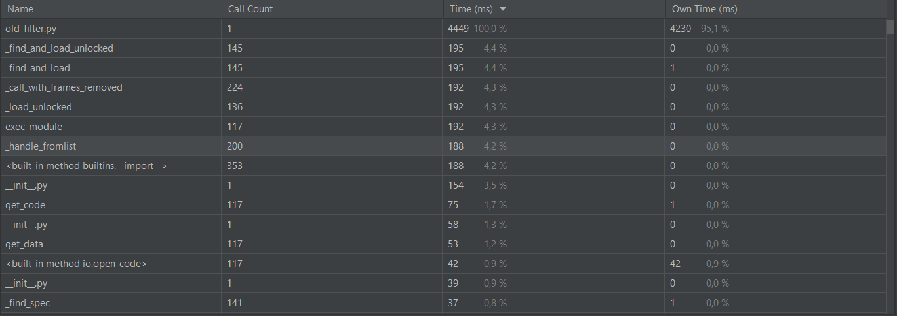
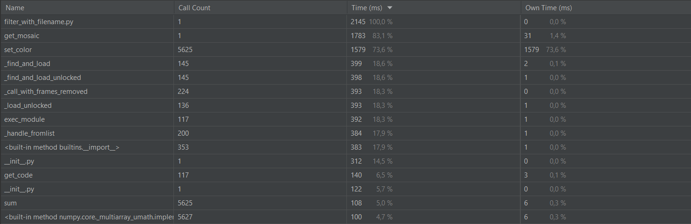

# Task-10
## Скриншоты профилизатора
1) Анализ fliter.py с помощью встроенного профилизатора pycharm 

2) Анализ old_filter.py с помощью встроенного профилизатора pycharm

Разница во времени обусловлена тем, что большая часть времени выполнения затрачивается на ввод данных.
3) Анализ filter_with_filename.py 

Уменьшение времени выполнения обусловлено тем, что пользователь больше не вводит в ручную данные.

## Изображения до преобразования и после
Исходное изображение

Результат выполнения filter_with_filename.py

Результат выполнения old_filter.py

## Doc-тестов пока нет, но есть докстринги в файле filter_with_filename.py